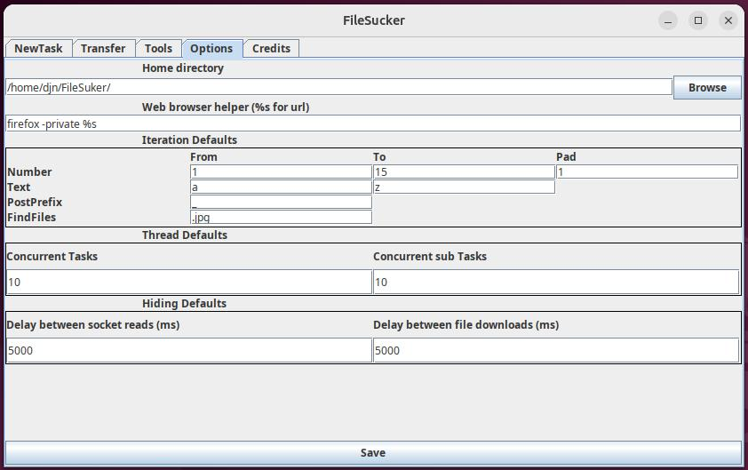
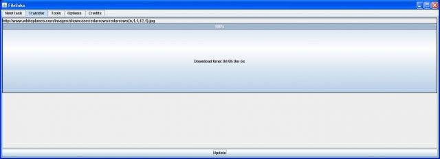
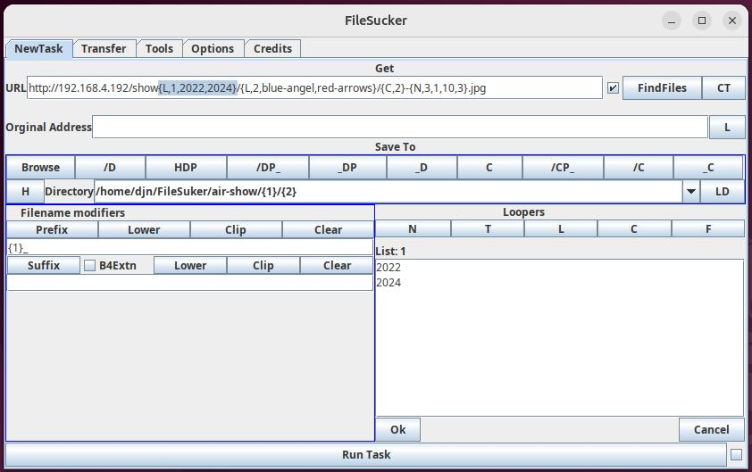
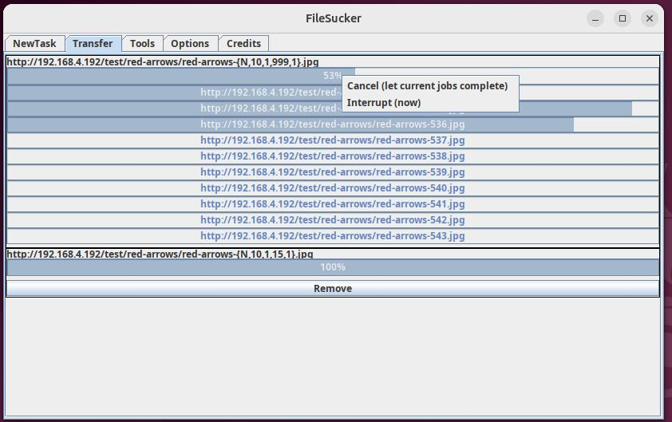
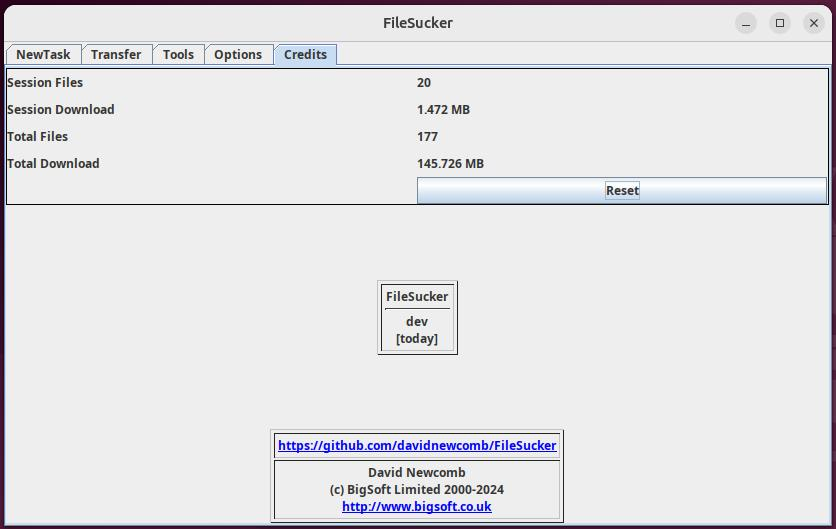
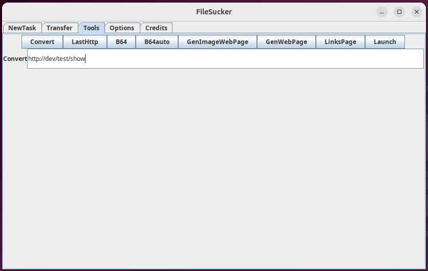

# FileSucker
Generates URLs from a pattern and downloads all the files.

# GUI Layout

The application is split into 5 sections
* NewTask - design your expression
* Transfer - show active downloads
* Tools - manipulate urls
* Options - settings and defaults
* Credits - total/session downloaded files/bytes

## New Task

### Get section

**URL**: url pattern, right click pastes from clipboard.
**Original Address**: If you need a specific referrer page, otherwise one is generated from the url. Right click pastes from clipd
**FindFiles**: go to the page in URL and create a looper using files found in Options:FindFiles.

Right-click in URL and Original Address pastes from the clipboard.

### Save To section
Construct directory you would like to save the downloaded files to. Looper IDs may be used in the construction.

*D* - directory
*P* - prefix
*C* - clipboard
*_* - post prefix character


### Filename modifiers section
Contruct the file name to save as. Looper IDs may be used here.

### Looper section
*N* - sequence number looper
*T* - sequence text looper
*L* - list looper
*C* - copy looper (repeat of existing looper)
*F* - fixed looper (a list of 1 entry, handy if needed in a looper expression)

# Example expressions

## http://hostname/red-arrows/red-arrows{N,1,1,10,2}.jpg
Will generated
- http://hostname/red-arrows/red-arrows01.jpg
- http://hostname/red-arrows/red-arrows02.jpg
- ...
- http://hostname/red-arrows/red-arrows10.jpg

## http://hostname/show{L,1,2022,2024}/{L,2,blue-angels,red-arrows}/{C,2}-{N,3,1,10,3}.jpg

* With directory: /air-show/{2}
* With filename: {1}_

Will generate:
- http://hostname/show2022/blue-angels/blue-angels-001.jpg -> /air-show/blue-angels/2022-blue-angels-001.jpg
- http://hostname/show2022/blue-angels/blue-angels-002.jpg -> /air-show/blue-angels/2022-blue-angels-002.jpg
- ...
- http://hostname/show2022/red-arrows/red-arrows-001.jpg -> /air-show/red-arrows/2022-red-arrows-001.jpg
- http://hostname/show2022/red-arrows/red-arrows-002.jpg -> /air-show/red-arrows/2022-red-arrows-002.jpg
- ...
- http://hostname/show2024/blue-angels/blue-angels-001.jpg -> /air-show/blue-angels/2024-blue-angels-001.jpg
- ...
- http://hostname/show2024/red-arrows/red-arrows-001.jpg -> /air-show/red-arrows/2024-red-arrows-001.jpg
- ...

# Screenshots







## Debug
FileSucker uses SLF4J so if you would like extra debug information then run with the following command:
```
java -Dorg.slf4j.simpleLogger.log.uk.co.bigsoft=debug -jar target/filesucker-0.0.1-SNAPSHOT.jar
```

## Work left to do

1. Delay between download reads and download files
2. Add to Maven Central

## Known bugs

1. Some option changes require a restart

## History
I wrote this application around 2000 and since then Java has change a lot and so have I!

It was hosted on [SourceForge](https://sourceforge.net) as [FileSuka](https://sourceforge.net/projects/filesuka) but I'm told that
the name does not translate well into Russian so I've changed it to [FileSucker](https://github.com/davidnewcomb/FileSucker) on GitHub.

The initial commit continues from is the last commit on SourceForge.

I have remodeled the whole application to use the MVC pattern.
