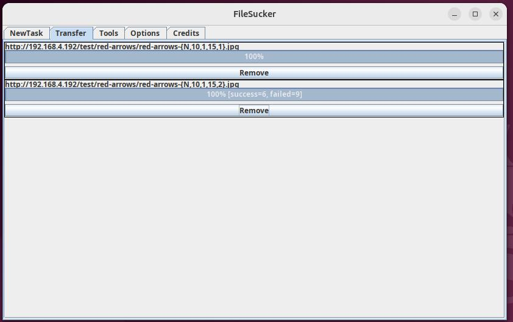

# FileSucker
Generates URLs from a pattern and downloads all the files.

# Screenshots

## History
I wrote this application around 2000 and since then Java has change a
lot and so have I!

It was hosted on [SourceForge](https://sourceforge.net) as [FileSuka](https://sourceforge.net/projects/filesuka) but I'm told that
the name does not translate well into Russian so I've changed it to [FileSucker](https://github.com/davidnewcomb/FileSucker) on GitHub.

The initial commit continues from is the last commit on SourceForge.
